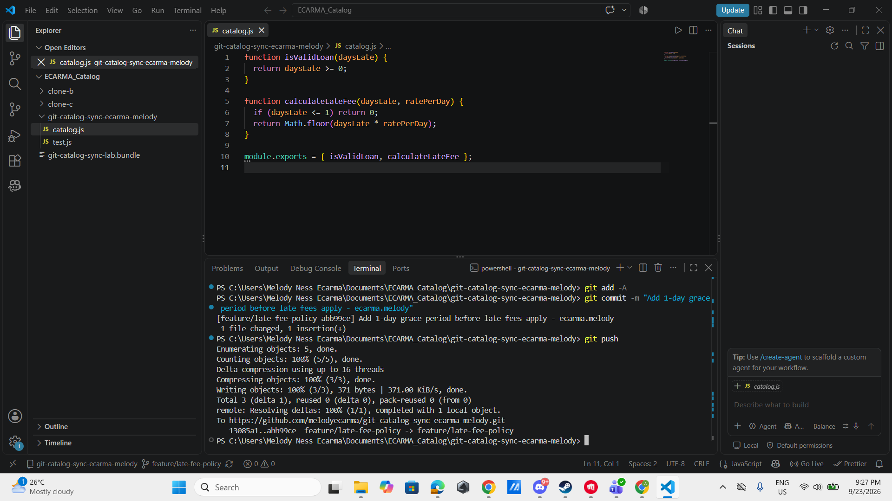
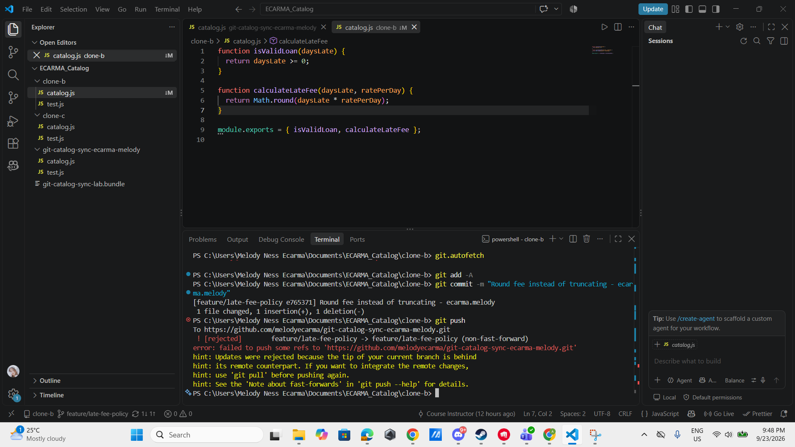
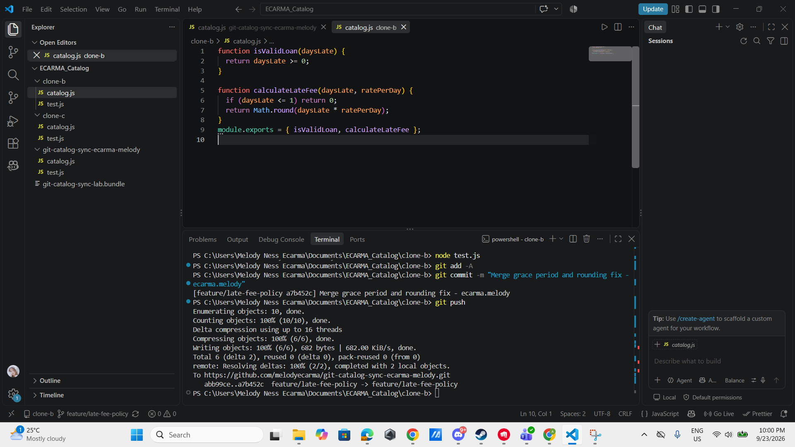
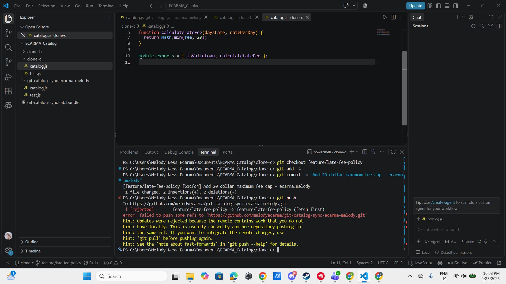
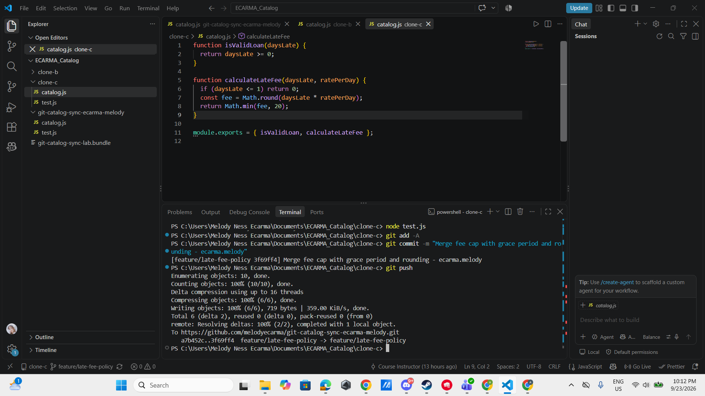
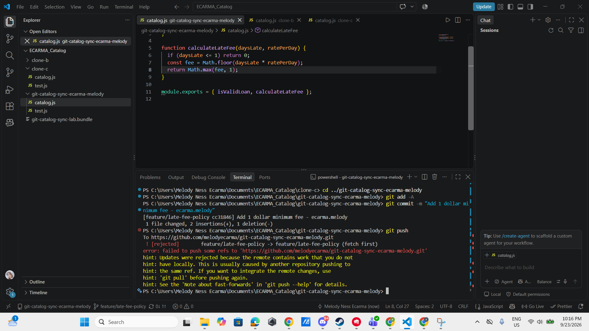
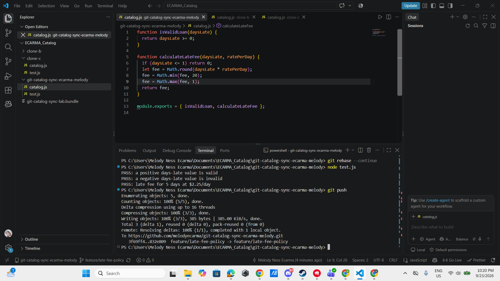
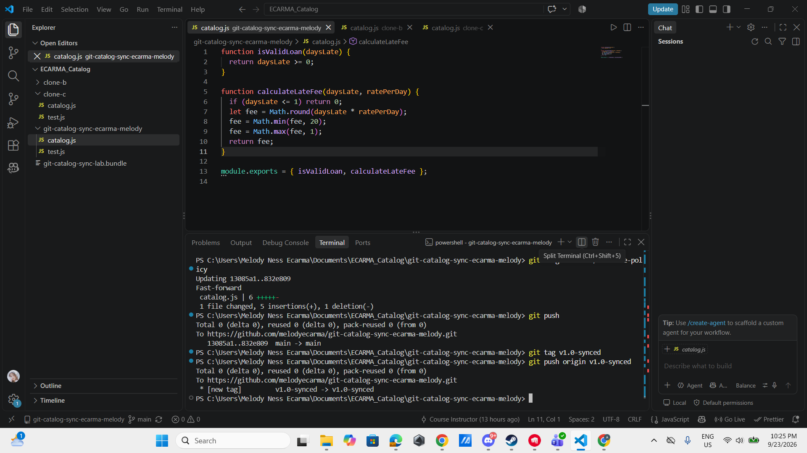

# WORKFLOW.md — Git Catalog Sync Lab
Ecarma, Melody Ness B.

## Task 1: Push from Clone A (grace period)

## Task 2: Rejected push in Clone B (rounding)

## Task 3: Merge resolved in Clone B

## Task 4: Rejected push in Clone C (cap)

## Task 5: Three-way merge resolved in Clone C

## Task 6: Rejected push in Clone A (minimum), then rebase

## Task 7: Merged to main and tagged

---

## Written Reflection

### 1. Final calculateLateFee walkthrough
function calculateLateFee(daysLate, ratePerDay) {
  if (daysLate <= 1) return 0;
  let fee = Math.round(daysLate * ratePerDay);
  fee = Math.min(fee, 20);
  fee = Math.max(fee, 1);
  return fee;
}

in this code `if (daysLate <= 1) return 0;` — the grace period. I added this in Clone A during Task 1, so no fee applies for the first day late. next is the let fee = Math.round(daysLate * ratePerDay); and the rounding fix. This came from Clone B in Task 2/3, replacing the original `Math.floor` so fees round to the nearest dollar instead of always rounding down. next is `fee = Math.min(fee, 20);` — the $20 cap. Clone C added this in Task 4/5 so no fee ever exceeds $20, regardless of how many days late. lastly, `fee = Math.max(fee, 1);` — the $1 minimum. I added this back in Clone A during Task 6, so any fee that would round to $0 (except for the grace period) is bumped up to at least $1.

### 2. Task 3 vs Task 5 — what got harder with a third line of work?

In Task 3, I was only reconciling two people's intent: my grace period against Clone B's rounding change. Since the two edits touched different parts of the logic, it was fairly easy to eyeball the conflict and combine them correctly.

In Task 5, I had to reconcile three changes at once — grace period, rounding, and the new $20 cap, all layered in the same function. The risk was higher because resolving the cap conflict meant I had to be careful not to accidentally revert or drop the rounding fix that was already merged in. With only two versions, it's easy to see which side each line came from; with three, I had to hold all three changes in my head simultaneously and double check the merged result actually produced correct output (via `node test.js`) rather than just looking "reasonable" on the surface.

### 3. Merge (Task 5) vs Rebase (Task 6) — what's the actual difference?
Merge (Task 5) created a new merge commit with two parents — my branch's history and origin's history stayed intact exactly as they happened, and the merge commit sits on top tying them together. While, Rebase (Task 6) took my single commit (the $1 minimum) and replayed it on top of the already-updated branch, as if I had made that change after everyone else's, rather than in parallel. There's no merge commit — the result is a straight, linear history. The end-state code was identical either way (same final function), but the shape of the commit graph is different: merge preserves the branching as it really happened, while rebase rewrites it to look like it happened in sequence.

### 4. What process change would have prevented all three rejections?
The simplest fix would be requiring everyone to run `git fetch` (or `git pull --rebase`) immediately before starting any new work on a shared branch, rather than only before pushing. All three rejections in this lab happened because each clone started editing from a stale snapshot of the branch — if Clone B, Clone C, and I (in Clone A for Task 6) had each checked for updates before touching `calculateLateFee`, we'd have seen the branch had already moved and could have coordinated instead of writing conflicting code blind.